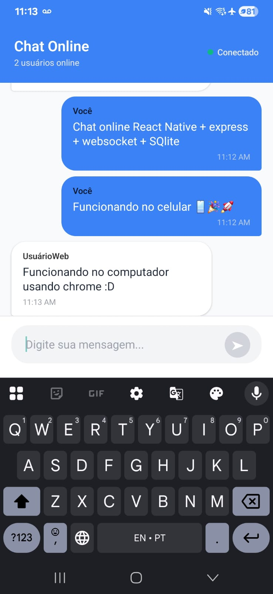

# 💬 Chat React Native

Um aplicativo de chat em tempo real desenvolvido com **React Native** e **WebSocket** para fins de estudo e aprendizado.
## 📱 Screenshots

<div align="center">
  
  <p><em>Interface principal do chat</em></p>
</div>


## 📱 Sobre o Projeto

Este é um chat em tempo real que permite comunicação instantânea entre múltiplos usuários. O projeto foi desenvolvido com foco no aprendizado de tecnologias modernas como React Native, TypeScript, WebSocket e arquitetura de aplicações móveis.

### ✨ Funcionalidades

- 🔐 **Autenticação simples** com nome de usuário
- 💬 **Mensagens em tempo real** via WebSocket
- 📜 **Histórico de mensagens** persistente
- 👥 **Lista de usuários online** em tempo real
- 📱 **Interface responsiva** e moderna
- 🎨 **Design limpo** com Material Design principles
- ⚡ **Scroll automático** para novas mensagens
- 🔄 **Reconexão automática** em caso de perda de conexão

## 🛠️ Tecnologias Utilizadas

### Frontend (React Native)
- **React Native 0.81.4** - Framework para desenvolvimento mobile
- **TypeScript** - Tipagem estática para JavaScript
- **React Hooks** - useState, useEffect, useRef
- **WebSocket API** - Comunicação em tempo real
- **React Native Safe Area Context** - Gerenciamento de área segura

### Backend (WebSocket Server)
- **Node.js** - Runtime JavaScript
- **WebSocket (ws)** - Protocolo de comunicação em tempo real
- **UUID** - Geração de identificadores únicos
- **Database** - Persistência de mensagens

## 📋 Pré-requisitos

Antes de começar, certifique-se de ter instalado:

- **Node.js** (versão 20 ou superior)
- **React Native CLI**
- **Android Studio** (para desenvolvimento Android)
- **Xcode** (para desenvolvimento iOS - apenas macOS)
- **Java Development Kit (JDK) 17**

## 🚀 Como Executar

### 1. Clone o repositório
```bash
git clone <url-do-repositorio>
cd chat
```

### 2. Instale as dependências
```bash
npm install
# ou
yarn install
```

### 3. Configure o servidor WebSocket
```bash
# Em uma nova aba do terminal, inicie o servidor
node server.js
# ou
npm run server
```

### 4. Inicie o Metro Bundler
```bash
npm start
# ou
yarn start
```

### 5. Execute o aplicativo

#### Android
```bash
npm run android
# ou
yarn android
```

#### iOS
```bash
# Primeiro, instale as dependências do CocoaPods
cd ios && pod install && cd ..

# Depois execute
npm run ios
# ou
yarn ios
```

## 📁 Estrutura do Projeto

```
chat/
├── src/
│   ├── screens/
│   │   ├── index.tsx      # Tela principal do chat
│   │   ├── types.ts       # Interfaces TypeScript
│   │   └── styles.ts      # Estilos do aplicativo
│   └── hooks/             # Custom hooks (futuro)
├── android/               # Configurações Android
├── ios/                   # Configurações iOS
├── App.tsx               # Componente raiz
├── package.json          # Dependências e scripts
└── README.md            # Documentação
```

## 🎯 Funcionalidades Técnicas

### WebSocket Implementation
- **Conexão persistente** entre cliente e servidor
- **Reconexão automática** em caso de falha
- **Tipagem TypeScript** para mensagens WebSocket
- **Tratamento de erros** robusto

### State Management
- **useState** para gerenciamento de estado local
- **useEffect** para efeitos colaterais
- **useRef** para referências DOM e WebSocket

### UI/UX Features
- **KeyboardAvoidingView** para melhor experiência com teclado
- **ScrollView** com scroll automático
- **Modal** para autenticação
- **Status indicators** para conexão

## 🔧 Configuração do Servidor

O servidor WebSocket está configurado para rodar na porta **8080**. Para alterar a configuração:

1. Edite o arquivo do servidor WebSocket
2. Modifique a URL no cliente React Native:

```typescript
// Em src/screens/index.tsx
const socket = new WebSocket('ws://SEU_IP:8080');
```

## 📱 Screenshots

### Interface do Chat


*Interface do aplicativo de chat mostrando mensagens em tempo real entre usuários mobile e web.*

## 🧪 Testes

```bash
npm test
# ou
yarn test
```

## 📚 Aprendizados

Este projeto foi desenvolvido com foco no aprendizado de:

- **React Native fundamentals**
- **TypeScript em projetos mobile**
- **WebSocket communication**
- **Real-time applications**
- **Component architecture**
- **State management patterns**
- **Mobile UI/UX design**


## 📝 Licença

Este projeto é de código aberto e está disponível sob a licença MIT. Veja o arquivo `LICENSE` para mais detalhes.

## 👨‍💻 Autor

**Gabriel** - Desenvolvedor Frontend Junior

- 📧 Email: [gabrielanacleto159@gmail.com]
- 💼 LinkedIn: [https://www.linkedin.com/in/gabriel-anacletoo]
- 🐙 GitHub: [https://github.com/gabrielanacletoo455]

---

## 📄 Licença

Este projeto é para fins de estudo e aprendizado. Sinta-se livre para usar como referência para seus próprios projetos!

---

*Desenvolvido com ❤️ para fins de estudo e aprendizado*